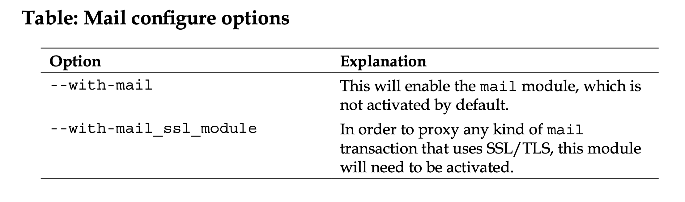
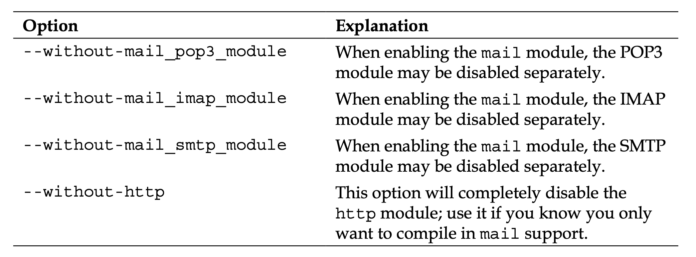
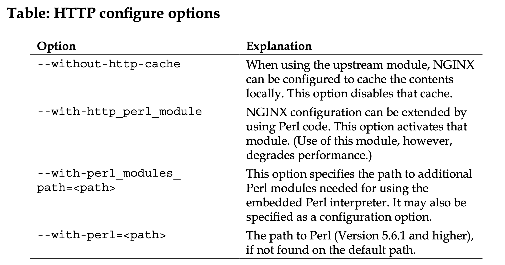
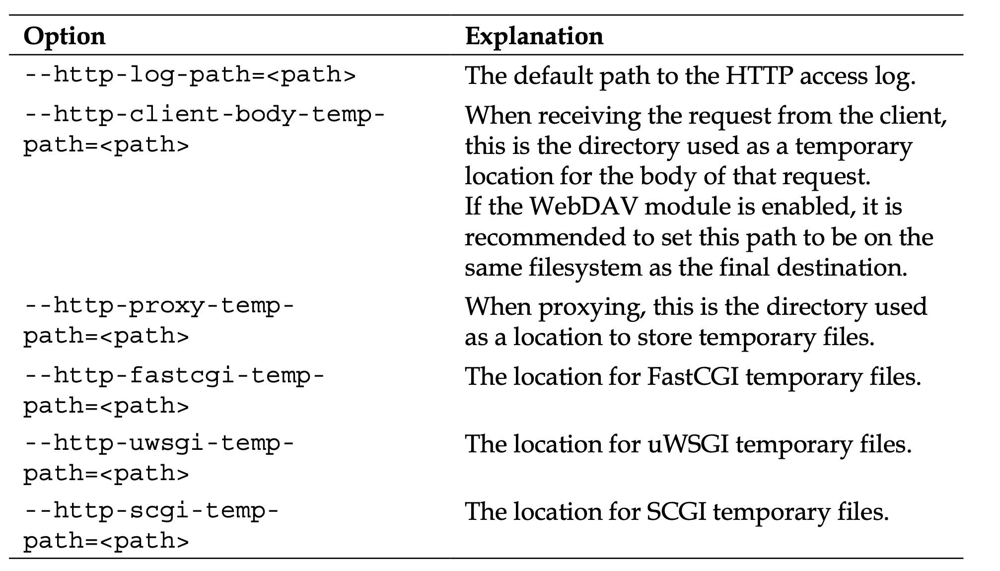
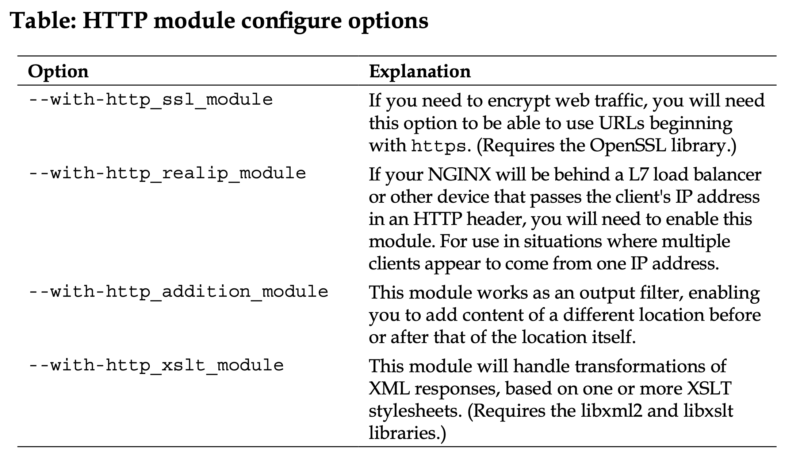
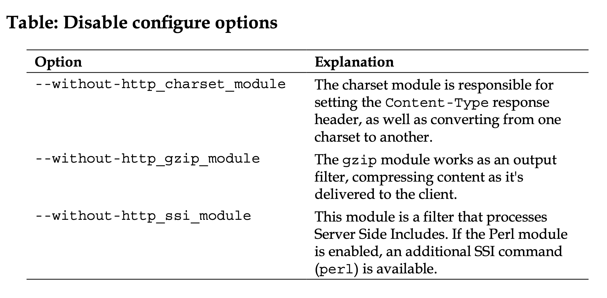
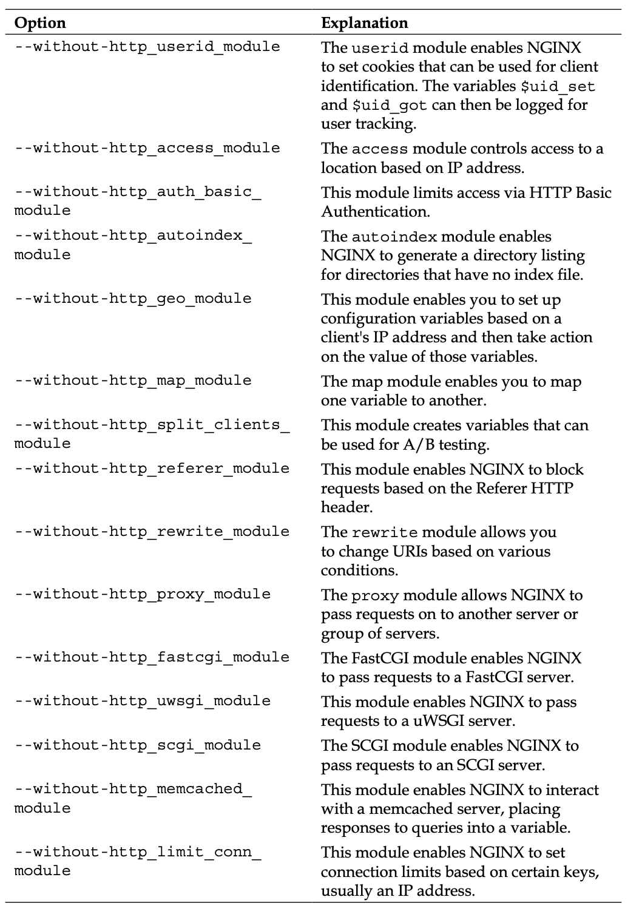
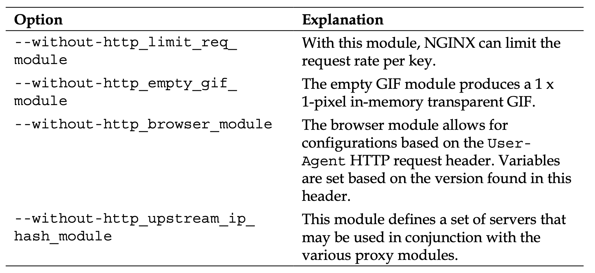

# Nginx

## Recommendation
Configure options for a web accelerator/proxy:

```
$ ./configure --with-http_ssl_module --with-http_realip_module --with-http_geoip_module --with-http_stub_status_module --with-openssl=${BUILD_DIR}/openssl-1.0.1c
```


And the following for a web server:

```
$ ./configure --with-http_stub_status_module
```


## Options/Params











